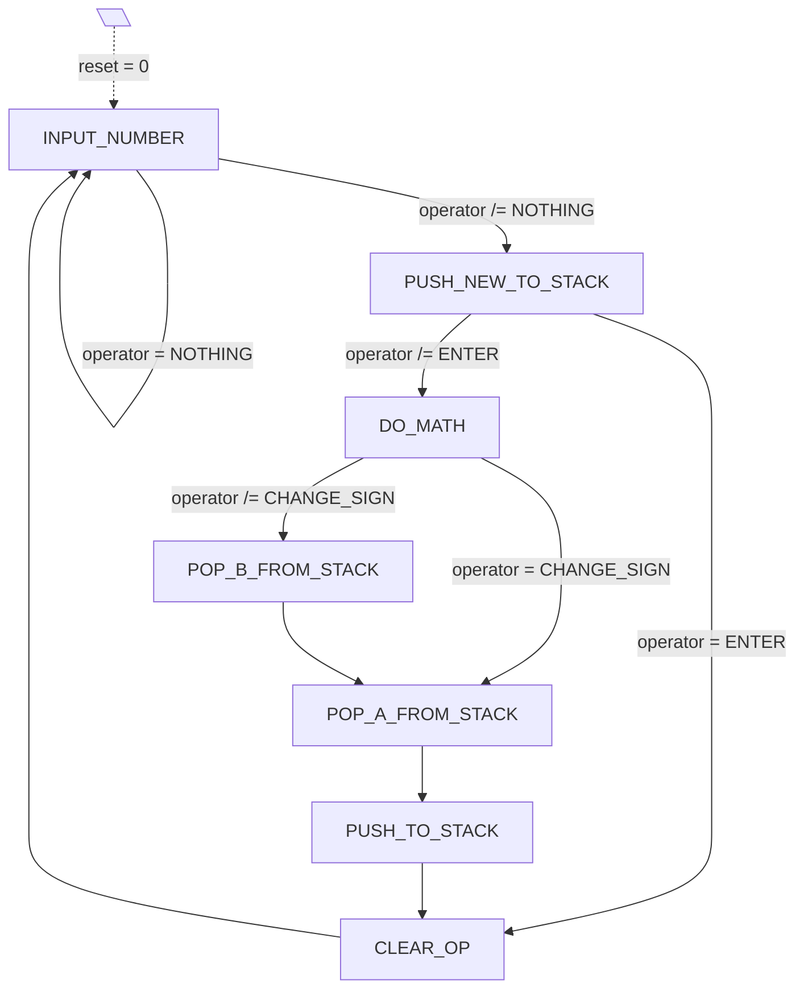

# vhdl

In diesem Ordner sind die benötigten VHDL Beschreibungen zu finden.

## Ordnerstruktur
Die VHDL Dateien sind entsprechend ihrer Funktion in Unterordner gegliedert.
Folgend ist ein kurzer Überblick gegeben wie diese Unterordner strukturiert sind:

```bash
.
│   rpn.vhdl        # Top-Level Entität "rpn"
│   datatypes.vhdl  # Globale Datentypen
│   *.vhdl          # diverse Support Entitäten
│
└───<entity_name>           # Ein "Modul" als Kombination verschiedener Entitäten.
    │   <entity_name>.vhdl  # Haupt-Entität welche von anderen Modulen verwendet werden kann.
    │   *.vhdl              # weitere (private) Entitäten
    │
    └───tb                  # Testbench(es) für die Entität(en)
```

Wichtig ist, dass jede Entität welche verwendet wird, in der Skriptdatei [files.tcl](../scripts/files.tcl) angegeben wird. Ansonsten wird diese nicht in das ModelSim oder Quartus Projekt eingebunden.

## rpn FSM


