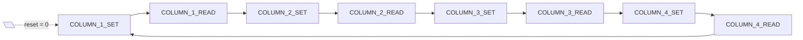
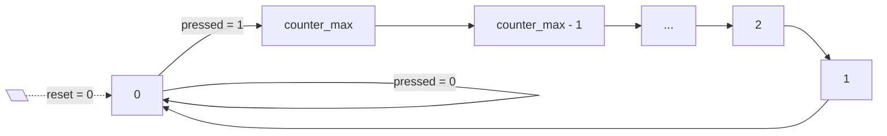

# Keypad Entity

Implementiert die Dekodierung des PMOD Keyboards von [Digilent](https://digilent.com/reference/pmod/pmodkypd/).

## FSMs
Für die [keypad_reader](keypad_reader.vhdl) und [keypad_debounce](keypad_debounce.vhdl) Entitäten wurden FSM's gemäss folgenden Zustandsdiagrammen implementiert. Die eckigen Kästchen stehen für Zustände und die Pfeile für Übergänge. Der initiale Zustand nach dem Reset (active low) ist mit einem gestrichelten Pfeil dargestellt.

Näheres zur Implementation wie z.B. die Ausgangslogik findet sich in der jeweiligen VDHL Datei der Entität.

### keypad_reader

Es ist wichtig, dass die Spalten für jeweils mehr als ein Takt (hier zwei Takte) aktiv sind. Die physische Tastatur ist mit einem Systemtakt von 80 MHz ansonsten zu langsam im reagieren.

### keypad_debounce

